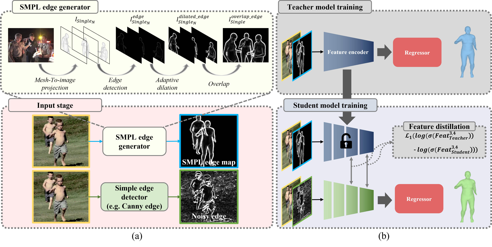
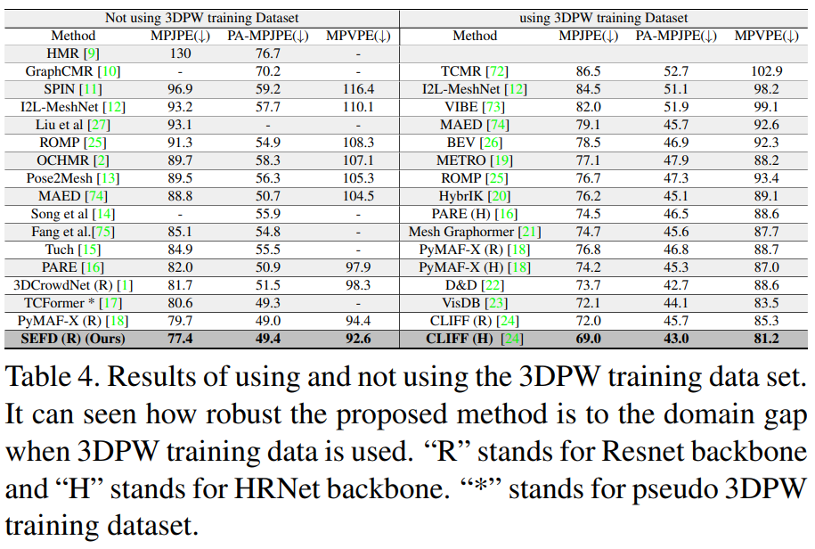

# ICCV2023_SEFD_RELEASE

[](https://paperswithcode.com/sota/3d-human-pose-estimation-on-3dpw?p=sefd-learning-to-distill-complex-pose-and)
[](https://paperswithcode.com/sota/2d-human-pose-estimation-on-ochuman?p=sefd-learning-to-distill-complex-pose-and)


* [ICCV 2023] SEFD : Learning to Distill Complex Pose and Occlusion
* Our Project Page URL : https://yangchanghee.github.io/ICCV2023_SEFD_page/
* The training code be updated!!(2023/10/16) 
* We've managed to make it work to some extent, but we anticipate that many issues may arise because we only uploaded very basic code. If you encounter any problems, please report them as issues immediately. We will make updates promptly! :)



## Our Project Page
You can check our project page at [here]([https://anonymous.4open.science/w/SEFD_page-EC0F/](https://yangchanghee.github.io/ICCV2023_SEFD_page/)).  
(To access smoothly, you need to hold down the Ctrl key and click with the mouse.)

## Thank you for providing a good baseline
We used [3DCrowdNet](https://github.com/hongsukchoi/3DCrowdNet_RELEASE) as a baseline, and whenever an issue occurred, the author of 3DCrowdnet responded kindly. I am always grateful to him


## 3DPW Result
🎇 SEFD achieves the SOTA on **[3DPW](https://virtualhumans.mpi-inf.mpg.de/3DPW/)**  
🎇 We improved **MPJPE** to 77.37 **PA-MPJPE** to **49.39mm** and **MPVPE** to **92.60mm** using a ResNet 50 backbone!  
   (Our model has no difference between baseline [3DCrowdNet](https://github.com/hongsukchoi/3DCrowdNet_RELEASE) model parameter and MACs.)  
   
This repo is the official **[PyTorch](https://pytorch.org)** implementation of **[SEFD : Learning to Learning to Distill Complex Pose and Occlusion]**.  


## Installation
We recommend you to use an [Anaconda](https://www.anaconda.com/) virtual environment. Install PyTorch >=1.6.0 and Python >= 3.7.3.  
To implement RCF edge detection, mmcv [here](https://pypi.org/project/mmcv/) must be installed.  
You need to install kornia [here](https://kornia.readthedocs.io/en/latest/get-started/installation.html) to implement canny edge detection.  
(This makes it possible to implement on GPU and canny edge is implemented many times faster than Opencv.)  
All this toolkit is on `requirements.sh` [here](./requirements.sh).  
Then, run `sh requirements.sh`. You should slightly change `torchgeometry` kernel code following [here](https://github.com/mks0601/I2L-MeshNet_RELEASE/issues/6#issuecomment-675152527).


## Quick demo  
### Preparing
* Download the pre-trained Baseline(3DCrowdNet) and SEFD checkpoint from [here](https://drive.google.com/drive/folders/1wlxCEWtVDoW3m-3zATkO8zB1oysMctR1?usp=sharing) and place it under `${ROOT}/demo/`. 
* Download demo inputs from [here](https://drive.google.com/drive/folders/1wlxCEWtVDoW3m-3zATkO8zB1oysMctR1?usp=sharing) and place them under `${ROOT}/demo/input` (just unzip the demo_input.zip).
* Make `${ROOT}/demo/output` directory.
* Get SMPL layers and VPoser according to [this](./assets/directory.md#pytorch-smpl-layer-and-vposer).
* Download `J_regressor_extra.npy` from [here](https://drive.google.com/file/d/1B9e65ahe6TRGv7xE45sScREAAznw9H4t/view?usp=sharing) and place under `${ROOT}/data/`.  

### Running (SEFD)
* Run `python demo.py --gpu 0 --model_path SEFD.pth.tar` or `python demo.py --gpu 0`. You can change the input image with `--img_idx {img number}`.  
* a rendered mesh image, and an input 2d pose are saved under  `${ROOT}/demo/`.

### Running (Baseline : 3DCrowdNet)
* Run `python demo.py --gpu 0 --model_path baseline.pth.tar`. You can change the input image with `--img_idx {img number}`.  
* a rendered mesh image, and an input 2d pose are saved under  `${ROOT}/demo/`.  

if you run the baseline, change [`${ROOT}/main/config.py`](./main/config.py)
```bash
distillation_module=True => False
distillation_loss="KD_loss" => ""
dilstillation_edge="Canny" => ""
distillation_pretrained=True => False
SMPL_overlap=True => False
SMPL_edge=True => False
first_input=True => False
nothing=False => True
```


The demo images and 2D poses are from [CrowdPose](https://github.com/Jeff-sjtu/CrowdPose) and [HigherHRNet](https://github.com/HRNet/HigherHRNet-Human-Pose-Estimation) respectively. 


## Results
🌝 Refer to the supplementary material for diverse qualitative results  




## Directory
Refer to [here](./assets/directory.md).

## SMPL_overlap_edge
* If you want to make your own SMPL_overlap_edge, check [here](./tool/SMPL_overlap_edge.md)
* If you want to Download SMPL overlap edge data [here](https://drive.google.com/drive/folders/1SNSPRPaxm5VhEA7f_0IDF5kmidYOda1D?usp=sharing)
* If you downloaded SMPL_overlap_edge, check [here](./assets/directory.md).

## Running SEFD
Frist finish the directory setting.
then, refer to [here](./assets/running.md) to train and test SEFD.

## Running SEFD with various edges
refer to [here](./assets/various_edge.md) to train and test SEFD with various edges.  
refer to [here](./assets/various_edge.md) to train and test without feature distillation.  
* To use variable edges, you must change the path of `${ROOT}/main/config.py`.
* line in 82, 84, 87 "putting your path" is your project directory. So you have to change it.

## Running SEFD with various losses
refer to [here](./assets/various_loss.md) to train and test SEFD with various losses.

## Running SEFD with various feature connection
refer to [here](./assets/various_feature_connections.md) to train and test SEFD with various feature connections.
